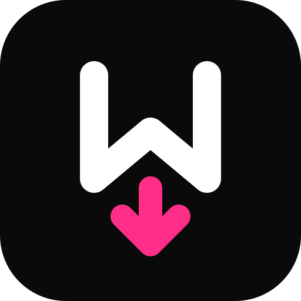

<p align="center">
  
</p>

<h1 align="center">Inkdown — Notion for Markdown</h1>

<p align="center"><strong>Write beautifully, ship Markdown in seconds.</strong> <code>pip install -e . && python main.py</code></p>

<p align="center">
  <a href="https://github.com/hariomlohardev/inkdown/releases"></a>
  <a href="https://www.python.org/downloads/"></a>
  <a href="https://github.com/hariomlohardev/inkdown/blob/main/LICENSE"></a>
  <a href="https://github.com/hariomlohardev/inkdown"></a>
  
  
  
  
  <a href="https://github.com/hariomlohardev/inkdown/issues?q=is%3Aissue+is%3Aopen+label%3A%22good+first+issue%22"></a>
</p>

<p align="center">
  <em>Beautiful, zero-config Markdown studio — Python-native, offline-first, no account.</em><br>
  <code>library</code> • <code>live preview</code> • <code>todos + widget</code> • <code>slides</code> • <code>chat</code> • <code>highlights</code> • <code>palette</code>
</p>

---

## Install

```bash
# Windows — one click
# Download Output/Inkdown-Setup.exe from Releases → Install → Launch from Start Menu

# From source (any OS for web preview)
git clone https://github.com/hariomlohardev/inkdown && cd inkdown
pip install -r requirements.txt        # or: pip install -e ".[dev]"
python main.py                          # desktop app (PyWebView)
python -m inkdown                       # same, package entry
npx serve app                           # web-only preview (no Python)
```

Requires Python 3.11+. Deps: `pywebview`, `pillow`, `pystray`, `keyboard`. Frontend: `marked`, `DOMPurify`, `highlight.js`, `KaTeX`, `mermaid` (vendored in `app/vendor/`).

## Usage

### 1 — Library (home)

```bash
python main.py                          # open library
python main.py notes.md                 # open with file (also: double-click .md in Explorer)
# In app:
# + New file (Ctrl+N) → type → Ctrl+S → folders → search (/) → archive
```

**Library keys:** `Ctrl+N` new • `Ctrl+O` import • `/` search • drag-drop `.md` • paste Markdown • import from URL

### 2 — Editor (write)

```bash
# Inside a doc:
Ctrl+E              # toggle edit (textarea + live preview, split drag)
Ctrl+B / Ctrl+I     # bold / italic
H                   # highlight selection (5 colors, persistent)
Ctrl+\              # table of contents (filter + minimap)
Ctrl+K              # search in doc
F                   # focus mode • F11 fullscreen
Ctrl+P              # palette (files, actions, settings)
```

**Pipeline:** `marked → DOMPurify → highlight.js / KaTeX (+ mhchem) / mermaid / callouts / emoji` in `app/src/scripts/markdown.js`.

### 3 — Power: Todos, Slides, Chat

```bash
# Todos
click Todos in sidebar  # or Ctrl+Alt+W widget
Ctrl+Alt+C              # quick capture from anywhere (daemon)

# Slides
right-click in doc → Present as Slides   # splits on ##, ←/→, F fullscreen

# Chat (AI)
Ctrl+Space              # open panel → @ for commands
# Configure in Settings → AI Chat: baseUrl, model, apiKey (stored locally)
```

## Demo

Screenshots live in `docs/screenshots/` (add yours via `html2canvas` export → PNG):

```bash
python main.py
# → Library → Editor → Todos → Slides → Palette → then
# Export → PNG / HTML via header menu
```

Preview: `docs/screenshots/library.png` · `editor.png` · `todos.png` · `slides.png` (generate locally — no `vhs` needed).

## Features

| Feature | Library | Editor | Power |
|---|:---:|:---:|:---:|
| Multi-file + folders + search + archive + import (file/URL/paste) | ✅ | — | — |
| Live preview + split + focus + TOC + minimap + word goal | — | ✅ | — |
| 180+ langs `hljs` + KaTeX + mermaid + callouts + footnotes + emoji | — | ✅ | — |
| 5-color highlights (H, persistent, duplicate-aware) | — | ✅ | — |
| Day-based todos + widget + streak + capture (`Ctrl+Alt+C`) | — | — | ✅ |
| Slides from `##` + fullscreen + progress + speaker notes | — | — | ✅ |
| Palette `Ctrl+P` + shortcuts (`Ctrl+/`) + version history + auto-save | — | — | ✅ |
| Tables → bar/line chart (canvas) + image viewer + export (md/html/pdf/png/zip) | — | ✅ | ✅ |
| Chat (`Ctrl+Space`, `@` commands, 12-lang translate, tone/summary) | — | — | ✅ |
| 100% local, offline, no telemetry, `localStorage + IndexedDB + inkdown-data.json` | ✅ | ✅ | ✅ |

## Themes

```bash
# In app: Settings → Appearance
# Theme: System / Light / Dark  — follows OS, or pick fixed
# Font: Serif / Sans / Mono / Atkinson Hyperlegible
# Accent: Pink (default) • Blue • Green • Purple • Orange
```

All CSS via `app/src/styles/tokens.css` — `data-theme="light|dark"` on `<html>`, `main.css` import chain. No bundler.

## Documentation

- **Markdown guide:** [`docs/markdown-guide.md`](docs/markdown-guide.md) — syntax Inkdown supports
- **Design docs:** [`internal/design/`](internal/design/) — 9 local deep-dives (overview, arch, backend, frontend, storage, features, styling, build/deploy, gotchas) — gitignored, for contributors
- **Help inside app:** `Ctrl+/` shortcuts modal, Settings pages, `docs/screenshots/`

## Development

```bash
git clone https://github.com/hariomlohardev/inkdown && cd inkdown
pip install -e ".[dev]"
python scripts/fetch_vendor.py   # refresh app/vendor/ (3.9MB, committed)
python scripts/make_icon.py      # regenerate icon.ico + icon.png
python -m pytest -q              # 4 passed
python main.py                   # desktop — q to quit, python main.py file.md also works
npx serve app                    # web — http://localhost:3000/app/index.html
build.bat                        # → dist/Inkdown/Inkdown.exe → Output/Inkdown-Setup.exe (Inno Setup)
```

See [`CONTRIBUTING.md`](CONTRIBUTING.md) and [`CLAUDE.md`](CLAUDE.md). `src` layout, `pyproject.toml` is source of truth, `Output/` + `dist/` + `icon.ico` are gitignored.

## Contributing — Good First Issues

**Want to contribute?** Issues are triaged for every level:

<a href="https://github.com/hariomlohardev/inkdown/issues?q=is%3Aissue+is%3Aopen+label%3A%22good+first+issue%22"></a> <a href="https://github.com/hariomlohardev/inkdown/issues?q=is%3Aissue+is%3Aopen+label%3A%22help+wanted%22"></a>

**Browse all:** https://github.com/hariomlohardev/inkdown/issues

- **Good First Issues (30 min, beginner):** One file, copy-paste steps — e.g., docstrings, `python main.py --help` text, `CONTRIBUTING.md` typo, new callout style.
- **Intermediate (60-90 min):** Pack/export polish, `peek`-style theme token, storage quota UI, `peek` demo parity.
- **Complex (1-2 days):** Plugin system, cloud sync (opt-in), Vim mode, multi-cursor.

Every issue has **exact file**, **acceptance checkboxes**, and **time estimate**. PRs with `good first issue` get priority review.

See [`CONTRIBUTING.md`](CONTRIBUTING.md) for workflow. `main` is the ship branch; Pages deploy lives in `.github/workflows/deploy.yml` (`app/` → Pages).

## Why Inkdown?

| Tool | Lacks |
|---|---|
| Notion | No offline Markdown files, no local-first, account required |
| Obsidian | No native slides/chat, heavier plugin model |
| VS Code + Markdown | No library/todos/slides polish, not writer-first |
| Typora / Mark Text | No todos/widget/daemon, no AI panel |

**Moat:** Every doc is a file. Every file is a slide deck. One hotkey from anywhere (`Ctrl+Alt+C`) and you’re back. `python main.py` is zero friction.

## Author

Built by [Hariom Lohar](https://hariomlohardev.github.io/) — hariomlohar.new@gmail.com

## License

MIT — see [`LICENSE`](LICENSE)
<!-- dummy PR test -->
