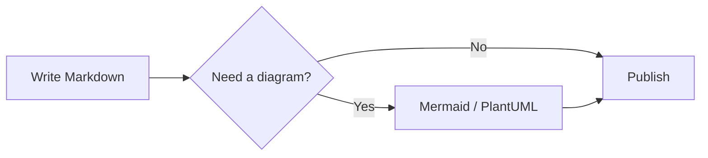
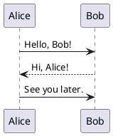

# The Inkdown Guide

> *Everything you need to write beautiful, powerful Markdown — all in one place.*

Welcome to **Inkdown**, a Markdown editor built for writers who care about both the *craft* of writing and the *power* of presentation. This document is both a **guide** and a **showcase**: every feature of Inkdown is demonstrated somewhere below.

---

## 🚀 Quick start

| Action | Shortcut |
|---|---|
| Save to library | `Ctrl + S` |
| Toggle edit mode | `Ctrl + E` |
| Search document | `Ctrl + K` |
| Open table of contents | `Ctrl + \` |
| Toggle todo widget | `Ctrl + Alt + W` |
| Quick-add todo | `Ctrl + Alt + T` |
| Toggle fullscreen | `F11` |
| Focus mode | `F` |
| Jump back after heading click | `Ctrl + [` |

---

## ✍️ Text formatting

The basics work as you'd expect: **bold**, *italic*, ~~strikethrough~~, and `inline code`. You can combine them freely: ***bold italic***, **`bold code`**, and so on.

Inkdown also supports `==highlighted text==`-style emphasis when enabled, and you can apply **persistent yellow highlights** by selecting any text and clicking the 🖍 button that appears.

> **Tip:** Hover over any heading to see its `#` anchor link — click it to copy a direct link to that section.

---

## 📑 Headings & structure

Inkdown automatically builds a **Table of Contents** from your headings. Open it with the button in the toolbar or with `Ctrl + \`.

### Third-level heading
Headings of level 1 through 4 appear in the TOC. Level 5 and 6 are treated as ordinary styled text.

#### Fourth-level heading
You can filter the TOC by level, search it, and collapse sections.

---

## 📋 Lists

Unordered, ordered, and task lists all render cleanly:

- First item
- Second item
  - A nested item
  - Another nested item
- Third item

1. Step one
2. Step two
3. Step three

### Task lists

- [x] Write the guide
- [x] Demonstrate every feature
- [ ] Ship it to the world
- [ ] Take a nap

---

## 💻 Code blocks

Fenced code blocks get syntax highlighting automatically. Hover a block to see the **Copy** button.

```python
def greet(name):
    """Say hello to someone."""
    message = f"Hello, {name}!"
    print(message)
    return message

greet("Inkdown user")
```

### Line highlighting

Append `{3,5-7}` to a fence to **highlight specific lines**. This is great for tutorials:

```javascript {2,5-7}
function fib(n) {
  if (n < 2) return n;          // base case — highlighted
  const a = fib(n - 1);
  const b = fib(n - 2);
  const result = a + b;         // highlighted
  console.log(`fib(${n}) = ${result}`);
  return result;                // highlighted
}
```

### Line numbers

Toggle **line numbers** from the **Aa** menu in the toolbar. They appear on every code block and make references like *"see line 42"* actually useful.

---

## 📊 Tables & charts

Tables render with horizontal scroll on small screens. When a table contains numeric columns, a **📊 Chart** button appears — click it to visualize the data.

| Quarter | Revenue | Expenses | Profit |
|---|---:|---:|---:|
| Q1 | 120 | 80 | 40 |
| Q2 | 150 | 90 | 60 |
| Q3 | 180 | 100 | 80 |
| Q4 | 220 | 110 | 110 |

Try clicking the **📊 Chart** button above this table and toggle between **Bar** and **Line** modes.

---

## 📐 Diagrams

### Mermaid diagrams

Fence a block with `mermaid` and Inkdown renders it live. Great for flowcharts, sequences, and timelines:



### PlantUML diagrams

For sequence diagrams and class diagrams, use `plantuml`:



---

## 📢 Callouts

Inkdown supports GitHub-style callouts — five colored, labeled boxes for different kinds of asides.

> [!NOTE]
> **Note** — extra context the reader might find useful.

> [!TIP]
> **Tip** — a helpful suggestion.

> [!IMPORTANT]
> **Important** — something the reader must know.

> [!WARNING]
> **Warning** — something to be careful about.

> [!CAUTION]
> **Caution** — a potentially dangerous action.

---

## 🔢 Math

Inline math: the equation $E = mc^2$ changed physics. Display math is centered and **auto-numbered**:

$$
\int_{-\infty}^{\infty} e^{-x^2}\, dx = \sqrt{\pi}
$$

$$
\sum_{n=1}^{\infty} \frac{1}{n^2} = \frac{\pi^2}{6}
$$

If a formula has an error, Inkdown shows a friendly **"math error"** badge instead of failing silently — so you can find and fix it.

---

## 📎 Footnotes

Footnotes let you add asides without breaking the flow.[^1] They appear at the bottom of the document with back-links.[^2]

[^1]: This is the first footnote. Click the ↩ to jump back.
[^2]: This is the second footnote. You can have as many as you like.

---

## 🖼️ Images

Standard images render with the alt text as a **caption**. You can control sizing with `=NN%`:

```markdown

```


Click any image to open the fullscreen **image viewer** — scroll to zoom, drag to pan, double-click to reset.

---

## 😄 Emoji shortcodes

Type `:rocket:`, `:sparkles:`, `:heart:`, `:fire:`, `:tada:`, `:books:`, `:memo:`, `:bulb:`, `:hammer:`, `:wrench:` and they turn into emoji automatically. There are hundreds available — try typing `:` in the editor and see what appears.

:rocket: :sparkles: :heart: :fire: :tada: :books: :memo: :bulb: :hammer: :wrench:

---

## 🔗 Links and quotes

External links [like this one](https://example.com) open in a new tab automatically. Internal anchor links like [jump to the top](#the-inkdown-guide) smooth-scroll within the document.

> *The secret of good writing is clarity, honesty, and respect for the reader's time.*
>
> — A very reasonable person

---

## 🧠 Using the Writing Assistant

Click the **✨ button** in the reader toolbar to open the Writing Assistant. It gives you seven tools to polish your document:

1. **Readability** — scores your text on a 0–100 Flesch scale and tells you whether it reads as Easy, Medium, or Hard.
2. **Broken links** — probes every external link and lists the ones that don't respond.
3. **Spelling** — catches common typos and lets you enable native browser spellcheck.
4. **Tone & inclusivity** — flags phrases like "obviously" or "simply" and suggests kinder alternatives.
5. **Summarizer** — generates a three-bullet TL;DR and lets you insert it at the top.
6. **Translate** — translates the summary into 12 languages, or gives you clean text to paste into any translator.
7. **Section order** — lets you drag `##` sections into a new order, then rewrites your file.

---

## 📌 Tips for great Markdown documents

A few principles that make any document read better:

- **Start with one sentence** that says what the document is about.
- **Use headings generously.** Every major idea deserves its own `##`.
- **Prefer lists over paragraphs** when listing things.
- **Put the conclusion at the top.** People read the first paragraph; they skim the rest.
- **Use callouts** (`> [!TIP]`) for the things readers *must* see.
- **Add diagrams** when a picture is worth a paragraph.
- **Test your links** before you publish — run the Broken Links checker.
- **Check readability** — a score under 50 usually means your sentences are too long.

---

## 💾 Exporting your work

From the export menu (the ⬇ icon):

- **Download .md** — the raw source, ready for GitHub.
- **Export as HTML** — a standalone file with embedded styles.
- **Save as PDF** — opens the print dialog; choose "Save as PDF".
- **Export as image** — renders the document to a crisp PNG.
- **Copy rendered** — pastes with formatting into Word, Gmail, Slack.
- **Copy share link** — encodes the whole document into a URL you can send.
- **Download backup** — a `.zip` of every file in your library.
- **Sync code** — copy/paste a code to move your library between devices.

---

## 🙏 Thank you for using Inkdown

Inkdown was built with one goal: make Markdown feel like a *studio*, not a notepad. If you found a bug, have an idea, or just want to say hi, this is the place to start a conversation.

> *"The best writing tool is the one that gets out of your way — and occasionally surprises you with how helpful it can be."*

Happy writing. :sparkles:
```
